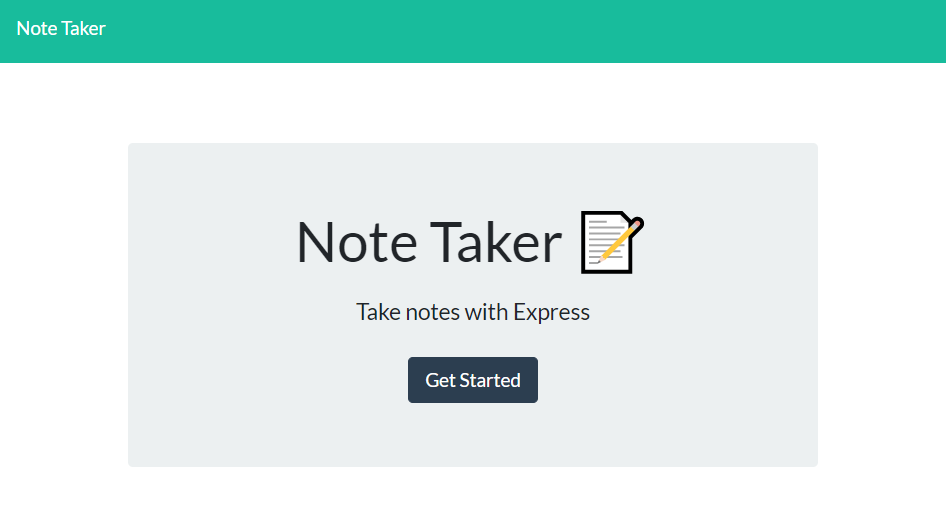

# Note Taker 

Note Taker is a server run application that allows the user to take notes and save them to a database which the user can reload at any given time. Each individual note has a different and unique number ID and there can be a total of at least 18,446,744,073,709,551,615 different notes saved. Granted that the users computer can handle that. Even if the user has created 2 notes with the same content and title they will both have a unique ID linked to them so the user can delete the exact note they want to.

Shout out to [Nikolas Lenning](https://github.com/nikolaslenning) and [Mason Short](https://github.com/LtWilhelm) for their big brains helping me out with my app.delete

This site is deployed [here](https://tranquil-retreat-23967.herokuapp.com/) on Heroku.

This application was authored in part by [Zach LaFleur](https://github.com/MrCartree)
